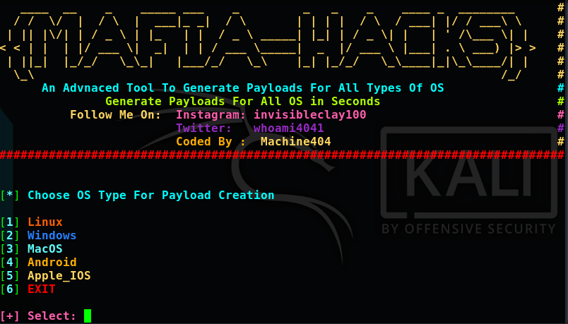
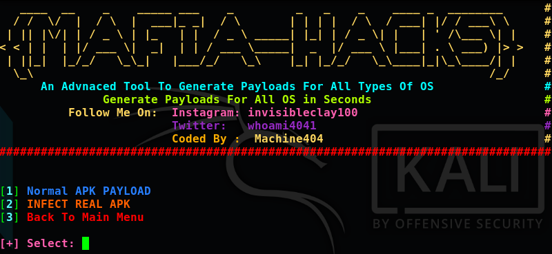
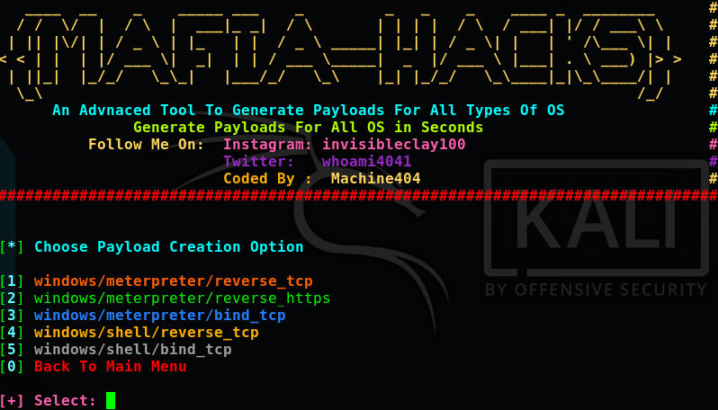

# mafiahacks

 

# Installation:
     1. git clone https://github.com/machine1337/mafiahacks.git
     2. chmod +x mafia.sh

# Usage:
    Open Terminal And Then Type:  bash mafia.sh
# Note:
   1. Android Payload Extension ( target.apk)
   2. Windows Payload Extension (target.exe)
   3. Linux Payload Extension   (target.elf)
   4. MacOS Payload Extension   (target.bin)
   5. Apple_IOS Payload Extension (target.macho)
   
# Features:
    * You Can Create Payloads For Following OS:
    1.  Linux Payloads
    2.  Windows Payloads
    3.  Android Payloads  ( Normal Apk Payload + Infect Real Apk )
    4.  MacOs  Payloads
    5.  Apple_IOS Payloads
    
    * Upcoming Features:
    1. Automatic NGROK Support For WAN attack
    2. Automatic Listener using msfconsole
    3. More Obfuscation
    4. Termux Users will also use this tool.
    
#  Follow Me On:
    
  1. https://twitter.com/whoami4041 
  2. https://instagram.com/invisibleclay100 
  3. https://www.youtube.com/channel/UCC_aPnmV_zGfdwktCFE9cPQ 
